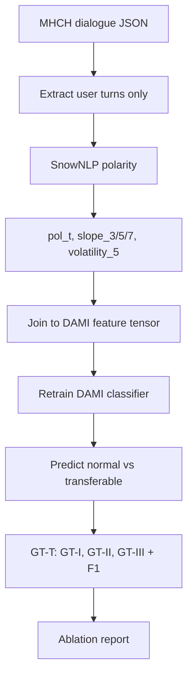

# Path A — Sentiment-Trend Features for **DAMI (Difficulty-Assisted Matching Inference)**

A detailed, standalone guide for **Path A**: adding **sentiment-trend** signals to **DAMI (Difficulty-Assisted Matching Inference)** — the handoff classifier from Liu et al. (AAAI 2021). This extends the short Project 3 section in `quick-wins-guide.md` and maps to **Quick Win #3** in `future-research.md`.

**Scope:** This guide uses **DAMI only** (repo: `WeijiaLau/MHCH-DAMI`). No **CEM (Causal-Enhance Module)** or other backbones.

**Implementation in this workspace:** Path A code lives in [`MHCH-DAMI-sentiment-trend/`](MHCH-DAMI-sentiment-trend/README.md), linked to upstream [`MHCH-DAMI/`](MHCH-DAMI/README.md) (`main` stays the paper baseline).

**Estimated time:** 3 working days (Days 7–9), plus ~½ day setup if you have not done Day 0 yet.

**Related docs:** `solutions.md` (literature gaps), `future-research.md` (research rationale), `quick-wins-guide.md` (full 2-week plan).

---

## 1. What you are building (plain English)

When a user talks to a chatbot, each reply carries emotional tone: neutral, frustrated, angry, relieved, and so on. Research already scores **one message at a time** and feeds that into handoff models. Your idea goes one step further:

> **Escalation is often driven not by how negative the latest message is, but by how quickly the user's mood is getting worse across the conversation.**

**Path A** implements that idea as **extra numeric features** (polarity, slope, volatility) and plugs them into **DAMI (Difficulty-Assisted Matching Inference)** — without inventing a new architecture.


| Signal                          | What it captures                                     | Example                                           |
| ------------------------------- | ---------------------------------------------------- | ------------------------------------------------- |
| **Current polarity** (`pol_t`)  | Is this message negative right now?                  | "This is useless" → strongly negative             |
| **Sentiment slope** (`slope_k`) | Is mood deteriorating over the last *k* user turns?  | Neutral → mild complaint → angry (negative slope) |
| **Volatility** (`volatility_5`) | Is the user emotionally unstable (swinging up/down)? | Alternating praise and anger → high std           |


---

## 2. How this fits the research papers

Sentiment on user answers **is already used** in your `Research papers/` collection. Path A does not repeat that; it **fixes a documented gap**.


| Paper                                                                | What it already does                                                                                          | Gap Path A addresses                                                          |
| -------------------------------------------------------------------- | ------------------------------------------------------------------------------------------------------------- | ----------------------------------------------------------------------------- |
| **Time to Transfer** — Liu et al., AAAI 2021                         | **DAMI (Difficulty-Assisted Matching Inference)** uses **SnowNLP** polarity on the **current** utterance only | No **trend**; generic lexicon, not domain-tuned — **this is what you extend** |
| **Lyapunov emotion-aware switching** — Tan & Shen, 2026 (background) | **Lyapunov Decay Rate (LDR)** triggers on fast emotional instability                                          | Heavy setup (**PAD**, **MBTI**); you borrow only the *idea* of rate-of-change |
| **Practical Bot Development** (book) (background)                    | Static **sentiment thresholds**                                                                               | Rule-based, reactive — not a trainable baseline                               |


**Your contribution in Path A:** extend **DAMI (Difficulty-Assisted Matching Inference)** with **trend features** (slope, volatility) on top of its existing **SnowNLP** polarity — evaluated on public **MHCH (Machine-Human Chatting Handoff)** Clothing / Makeup corpora in a few days.

---

## 3. Acronym and term glossary

Use this table when you see a short form in code or papers.


| Short form     | Long form / meaning                                                                                                                     |
| -------------- | --------------------------------------------------------------------------------------------------------------------------------------- |
| **MHCH**       | Machine-Human Chatting Handoff — deciding when a bot should pass the conversation to a human                                            |
| **DAMI**       | Difficulty-Assisted Matching Inference — utterance-level classifier from Liu et al. (AAAI 2021); **the only model you train in Path A** |
| **GT-T**       | Golden Transfer within Tolerance — evaluation metric that rewards handoffs near the gold moment                                         |
| **GT-I**       | GT-T level I — strict: predicted handoff turn must match gold turn exactly                                                              |
| **GT-II**      | GT-T level II — allows handoff within a **tolerance window** before gold (earlier is OK)                                                |
| **GT-III**     | GT-T level III — wider tolerance (more early/late flexibility)                                                                          |
| **λ** (lambda) | Tolerance coefficient in **GT-T** — higher λ = more credit for early handoff                                                            |
| **F1**         | F1 score — harmonic mean of precision and recall for `transferable` vs `normal`                                                         |
| **POS**        | Part-of-Speech — grammatical tags used in **DAMI** difficulty features                                                                  |
| **PAD**        | Pleasure–Arousal–Dominance — 3D emotion space in the Lyapunov paper                                                                     |
| **LDR**        | Lyapunov Decay Rate — speed of emotional instability (background only; Path A uses slope instead)                                       |
| **SnowNLP**    | Chinese-oriented sentiment library — matches **DAMI** and Clothing / Makeup datasets                                                    |
| **NLP**        | Natural Language Processing                                                                                                             |
| **AI**         | Artificial Intelligence                                                                                                                 |


---

## 4. Prerequisites (Day 0 — do this first if needed)

Path A reuses the environment and data from `quick-wins-guide.md` Day 0.

### 4.1 Python environment

```bash
conda create -n escalation python=3.10 -y
conda activate escalation

pip install torch transformers datasets accelerate \
            scikit-learn pandas numpy matplotlib seaborn \
            snownlp pyarrow   # pyarrow for parquet feature files
```

### 4.2 Datasets (required for Path A)


| Dataset      | Language | Download                                                 | Used for                           |
| ------------ | -------- | -------------------------------------------------------- | ---------------------------------- |
| **Clothing** | Chinese  | [MHCH-DAMI repo](https://github.com/WeijiaLau/MHCH-DAMI) | Primary train / test               |
| **Makeup**   | Chinese  | Same repo                                                | Second test split (generalisation) |


Path A does **not** use other datasets — **DAMI** was built and evaluated on Clothing and Makeup only.

Clone the **MHCH-DAMI** repository — it includes **DAMI (Difficulty-Assisted Matching Inference)** code, data loaders, and **GT-T (Golden Transfer within Tolerance)** evaluation scripts:

```bash
git clone https://github.com/WeijiaLau/MHCH-DAMI.git
cd MHCH-DAMI
# follow repo README for data paths
```

### 4.3 Repo layout (minimal for Path A)

```
escalation-quickwins/
├── data/
│   └── mhch/              # Clothing, Makeup from MHCH-DAMI
├── src/
│   ├── trends.py          # sentiment + slope + volatility
│   ├── build_features.py  # per-dialogue feature tables
│   └── metrics.py         # GT-T, F1 wrappers
├── notebooks/
│   └── 03_sentiment_trend.ipynb
└── results/
    ├── figures/
    └── 03_sentiment_trend_report.md   # final deliverable
```

---

## 5. Core concepts before you code

### 5.1 Only score **user** turns

Sentiment trend must reflect **the customer**, not the bot.

1. Walk the dialogue turn by turn.
2. Keep a list `user_history` of user message strings only.
3. At bot turn *t*, compute features from `user_history` **up to and including** the latest user message — never from future turns (**no data leakage**).

### 5.2 Polarity scale

Map **SnowNLP** output to **[-1, 1]** so positive = happy, negative = frustrated (same convention as the original **DAMI** paper):

- `pol_t = 2 * SnowNLP(text).sentiments - 1`

### 5.3 Slope = mood direction

Fit a line over the last *k* polarity values. **Negative slope** → mood deteriorating → stronger escalation signal.

### 5.4 Why retrain **DAMI (Difficulty-Assisted Matching Inference)** instead of rules only?

A fixed rule like "escalate if slope < -0.2" is easy but ignores dialogue difficulty and repetition patterns **DAMI** already models. Retraining with extra features tests whether trend adds information **beyond** the published baseline — that is what makes the result research-worthy.

---

## 6. Day 7 — Feature engineering

**Goal:** For every user utterance in every dialogue, produce a row in a feature table.

### 6.1 Implement `src/trends.py`

```python
# src/trends.py
from snownlp import SnowNLP
import numpy as np

def utterance_polarity(text: str) -> float:
    """SnowNLP polarity mapped to [-1, 1] (DAMI convention)."""
    return 2 * SnowNLP(text).sentiments - 1

def sentiment_slope(user_history: list[str], k: int = 5) -> float:
    """
    Linear slope over last k user messages.
    Negative slope => mood deteriorating.
    """
    polarity_fn = utterance_polarity
    pols = [polarity_fn(u) for u in user_history[-k:]]
    if len(pols) < 2:
        return 0.0
    x = np.arange(len(pols))
    slope, _ = np.polyfit(x, pols, 1)
    return float(slope)

def sentiment_volatility(user_history: list[str], k: int = 5) -> float:
    polarity_fn = utterance_polarity
    pols = [polarity_fn(u) for u in user_history[-k:]]
    if len(pols) < 2:
        return 0.0
    return float(np.std(pols))
```

### 6.2 Feature vector per user utterance

At user turn index *t* with history `user_history`:


| Feature          | Symbol         | Description                                   |
| ---------------- | -------------- | --------------------------------------------- |
| Current polarity | `pol_t`        | Sentiment of latest user message              |
| Slope (3 turns)  | `slope_3`      | Trend over last 3 user messages               |
| Slope (5 turns)  | `slope_5`      | Trend over last 5 user messages               |
| Slope (7 turns)  | `slope_7`      | Trend over last 7 user messages               |
| Volatility       | `volatility_5` | Std dev of polarity over last 5 user messages |


**Short dialogues:** If fewer than *k* user turns exist, compute slope on whatever is available; if fewer than 2 turns, set slope and volatility to `0.0`.

### 6.3 Build the feature file (`src/build_features.py`)

Pseudocode:

```python
# For each dialogue:
user_history = []
for turn in dialogue:
    if turn.role == "user":
        user_history.append(turn.text)
        row = {
            "dialogue_id": dialogue.id,
            "turn_id": turn.id,
            "pol_t": utterance_polarity(turn.text),
            "slope_3": sentiment_slope(user_history, k=3),
            "slope_5": sentiment_slope(user_history, k=5),
            "slope_7": sentiment_slope(user_history, k=7),
            "volatility_5": sentiment_volatility(user_history, k=5),
            "label": turn.label,  # normal / transferable from MHCH
        }
        save(row)
```

Export to `data/mhch/sentiment_features_clothing.parquet` (and Makeup likewise).

### 6.4 Day 7 checks

- Spot-check 10 rows: negative user text → `pol_t` < 0.
- Plot `slope_5` over time for one frustrating dialogue — should trend downward before gold handoff.
- Confirm no future user turns appear in any row's history.

**Day 7 output:** Feature parquet files + histogram of `pol_t` and `slope_5`.

---

## 7. Day 8 — Integrate into **DAMI (Difficulty-Assisted Matching Inference)**

**Goal:** Retrain **DAMI** with trend features and run test inference.

### 7.1 Repository

All training and evaluation happen inside `**WeijiaLau/MHCH-DAMI`**:

```bash
git clone https://github.com/WeijiaLau/MHCH-DAMI.git
cd MHCH-DAMI
```

Work on a branch (e.g. `sentiment-trend`) so you can diff changes against the upstream **DAMI** baseline.

### 7.2 Where to inject features

In the **MHCH-DAMI** codebase, find the tensor that concatenates utterance-level features before the **DAMI** classifier (often named like `feature_concat`, `utterance_repr`, or similar). Append five scalars:

```python
import torch

extra = torch.tensor(
    [pol_t, slope_3, slope_5, slope_7, volatility_5],
    dtype=torch.float32,
)
v_t = torch.cat([v_t, extra], dim=-1)
```

Load `pol_t`, slopes, and volatility from your Day 7 parquet by `(dialogue_id, turn_id)`.

### 7.3 Training protocol (match the **DAMI** paper)

- Use the **same hyperparameters** as Liu et al. (2021) — learning rate, batch size, epochs, hidden size (see `MHCH-DAMI` config / README).
- Train on **Clothing** train split; validate on Clothing dev if the repo provides one.
- Do **not** change the loss, label set, or **DAMI** architecture — only the input dimension grows by 5.
- Train two runs for ablation:
  - `**dami_baseline.pt`** — stock **DAMI** (reproduce paper; no extra features).
  - `**dami_trend_full.pt`** — **DAMI** + full trend bundle (`pol_t`, `slope_3`, `slope_5`, `slope_7`, `volatility_5`).

### 7.4 Day 8 checks

- Training loss decreases (no NaNs from bad features).
- Input dim in the first epoch log = original_dim + 5.
- Inference runs on Clothing test without shape errors.

**Day 8 output:** Two trained checkpoints (baseline vs trend-full).

---

## 8. Day 9 — Evaluation and ablation

**Goal:** Prove trend features help, especially for **early** handoff (**GT-II**, **GT-III**).

### 8.1 Metrics to report


| Metric       | Long form                 | What it tells you                                            |
| ------------ | ------------------------- | ------------------------------------------------------------ |
| **F1**       | F1 score                  | Standard utterance-level classification quality              |
| **Macro-F1** | Macro-averaged F1         | Fairer under class imbalance (~19% transferable in **MHCH**) |
| **GT-I**     | Golden Transfer level I   | Strict timing — did you hand off on the exact gold turn?     |
| **GT-II**    | Golden Transfer level II  | Tolerates **early** handoff within λ — proactive detection   |
| **GT-III**   | Golden Transfer level III | Wider tolerance — best score when λ is generous              |


Use the **GT-T (Golden Transfer within Tolerance)** implementation from the **MHCH-DAMI** repo. Set **λ (lambda) = 0** first (strict), then try λ > 0 as in the paper.

**DAMI (Difficulty-Assisted Matching Inference) paper baselines (Clothing)** — reproduce before claiming improvement:


| Variant                      | F1   | GT-I | GT-II | GT-III |
| ---------------------------- | ---- | ---- | ----- | ------ |
| **DAMI** (published)         | 67.3 | 70.3 | 79.1  | 83.9   |
| **DAMI** + `pol_t` only      | …    | …    | …     | …      |
| **DAMI** + `slope_5` only    | …    | …    | …     | …      |
| **DAMI** + full trend bundle | …    | …    | …     | …      |


**What success looks like:**

- **F1** and **GT-I** improve slightly or stay flat.
- **GT-II** and **GT-III** improve more clearly → model hands off **earlier** without being punished.
- Full bundle beats single-feature ablations → slope and volatility add real signal.

### 8.2 Ablation procedure

1. Run inference for each checkpoint on **Clothing** test and **Makeup** test.
2. Compute **F1**, **Macro-F1**, **GT-I**, **GT-II**, **GT-III** for each variant.
3. Plot confusion matrix for `normal` vs `transferable`.
4. Optional: case study — 3 dialogues where trend model triggers earlier than baseline.

### 8.3 Write the deliverable

Create `results/03_sentiment_trend_report.md` containing:

1. **Motivation** — one paragraph (current sentiment vs trend).
2. **Method** — features table + diagram.
3. **Results** — ablation table + Clothing vs Makeup.
4. **Discussion** — did **GT-II** / **GT-III** gain more than **GT-I**?
5. **Limitations** — **SnowNLP** is generic and Chinese-oriented; **DAMI** does not model queue load or labor cost; trend features are not domain-calibrated yet.
6. **Next steps** — hybrid scorer (Path B in `future-research.md`), calibration (Project 1).

**Day 9 output:** Report + `results/figures/confusion_trend.png` + `results/figures/slope_example.png`.

---

## 9. End-to-end workflow (mermaid)




---

## 10. Common pitfalls and fixes


| Problem                                         | Cause                             | Fix                                                                                     |
| ----------------------------------------------- | --------------------------------- | --------------------------------------------------------------------------------------- |
| **SnowNLP** scores feel weak on some utterances | Generic lexicon, not domain-tuned | Expected gap — note in report; optional follow-up: fine-tune polarity on handoff labels |
| **GT-II** unchanged but **F1** up               | Model handoffs later, not earlier | Inspect per-dialogue trigger turn vs gold; tune decision threshold on validation        |
| Shape mismatch in **DAMI**                      | Feature join keys wrong           | Align `(dialogue_id, turn_id)` with repo's utterance index                              |
| Data leakage                                    | Future turns in slope window      | Rebuild `user_history` strictly left-to-right                                           |
| Short chats                                     | < 2 user turns                    | Set `slope_* = 0`, `volatility_5 = 0`                                                   |
| Class imbalance                                 | ~19% transferable                 | Report **Macro-F1** alongside **F1**                                                    |


---

## 11. What Path A does *not* include (save for later)

These are valuable but belong to other paths in `future-research.md`:


| Item                                              | Path                               |
| ------------------------------------------------- | ---------------------------------- |
| Calibrating sentiment scores to handoff labels    | Project 1 — confidence calibration |
| Auto-tuning thresholds **λ (lambda)**, **T**      | Project 2 — Bayesian optimisation  |
| Combining sentiment + queue load + bot confidence | Medium project #5 — hybrid scorer  |
| **PAD (Pleasure–Arousal–Dominance)** dynamics     | Lyapunov paper — much heavier      |


---

## 12. Checklist summary

### Before Day 7

- Conda env with `snownlp`, `torch`, `pandas`, `pyarrow`
- **MHCH-DAMI** repo cloned; **Clothing** + **Makeup** data available

### Day 7

- `src/trends.py` implemented
- Feature parquet for all user turns
- Leakage and spot-checks passed

### Day 8

- Five features appended to **DAMI (Difficulty-Assisted Matching Inference)** tensor 
- Baseline and trend-full models trained

### Day 9

- Ablation table vs published **DAMI** numbers
- `results/03_sentiment_trend_report.md` + figures committed

---

## 13. References in this repository


| File                                     | Relevance                                                                      |
| ---------------------------------------- | ------------------------------------------------------------------------------ |
| `solutions.md`                           | Group 2 — **DAMI (Difficulty-Assisted Matching Inference)** gaps and baselines |
| `future-research.md`                     | Quick Win #3 — sentiment-trend on **DAMI**                                     |
| `quick-wins-guide.md`                    | Day 0 setup, Project 3 code snippets                                           |
| `Research papers/Time to Transfer.pdf`   | Original **DAMI** + **GT-T (Golden Transfer within Tolerance)** definitions    |
| `https://github.com/WeijiaLau/MHCH-DAMI` | **DAMI** code, Clothing / Makeup data, **GT-T** scripts                        |


---

## 14. One-sentence pitch (for a report or presentation)

> We extend **DAMI (Difficulty-Assisted Matching Inference)** with **sentiment-trend** features — polarity slope and volatility over recent **user** turns — showing that **how fast** mood deteriorates improves **Golden Transfer within Tolerance (GT-T)** early-detection (**GT-II**, **GT-III**) beyond the single-utterance **SnowNLP** polarity in the original **DAMI** model.

